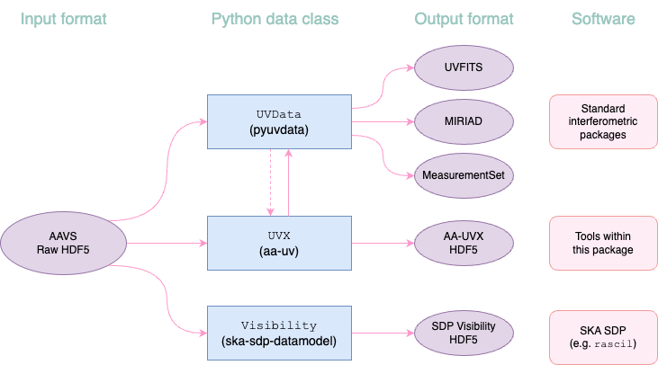

# `aa_uv` command-line utility



The `aa_uv` command-line utility converts the HDF5 output from AAVS/AA0.5 stations into a file format
of your choosing. Currently supported:

* [UVFITS](https://www.google.com/url?sa=t&source=web&rct=j&opi=89978449&url=https://library.nrao.edu/public/memos/aips/memos/AIPSM_117.pdf&ved=2ahUKEwiU8NDPzIyGAxVGcvUHHaCbDHYQFnoECBgQAQ&usg=AOvVaw20kSnIm25f6jj2-xvR-KWS)
* [MIRIAD](https://www.atnf.csiro.au/computing/software/miriad/doc/userguide/userhtml.html)
* CASA [MeasurementSet](https://casadocs.readthedocs.io/en/stable/notebooks/casa-fundamentals.html#MeasurementSet-v2)
* The `ska_ost_low_uv` [UVX](/uvx.html) format
* The [SDP Visibility format](https://developer.skao.int/projects/ska-sdp-datamodels/en/latest/api/ska_sdp_datamodels.visibility.Visibility.html#ska_sdp_datamodels.visibility.Visibility) (from `ska-sdp-datamodels`).


```
$ aa_uv -h
usage: aa_uv [-h] -o OUTPUT_FORMAT [-c ARRAY_CONFIG] [-n TELESCOPE_NAME] [-s] [-j] [-b] [-B] [-x FILE_EXT]
               [-i CONTEXT_YAML] [-w NUM_WORKERS] [-v] [-p PARALLEL_BACKEND] [-N N_INT_PER_FILE] [-z]
               infile outfile

AAVS UV file conversion utility

positional arguments:
  infile                Input filename
  outfile               Output filename

options:
  -h, --help            show this help message and exit
  -o OUTPUT_FORMAT, --output_format OUTPUT_FORMAT
                        Output file format (uvx, uvfits, miriad, ms, uvh5, sdp). Can be comma separated for multiple
                        formats.
  -c ARRAY_CONFIG, --array_config ARRAY_CONFIG
                        Array configuration YAML file. If supplied, will override ska_ost_low_uv internal array configs.
  -n TELESCOPE_NAME, --telescope_name TELESCOPE_NAME
                        Telescope name, e.g. 'aavs3'. If supplied, will attempt to use ska_ost_low_uv internal array config.
  -s, --phase-to-sun    Re-phase to point toward Sun (the sun must be visible!). If flag not set, data will be phased
                        toward zenith.
  -j, --no_conj         Do not conjugate visibility data (note AAVS2 and AAVS3 require conjugation)
  -b, --batch           Batch mode. Input and output are treated as directories, and all subfiles are converted.
  -B, --megabatch       MEGA batch mode. Runs on subdirectories too, e.g. eb-aavs3/2023_12_12/*.hdf5.
  -x FILE_EXT, --file_ext FILE_EXT
                        File extension to search for in batch mode
  -i CONTEXT_YAML, --context_yaml CONTEXT_YAML
                        Path to observation context YAML (for SDP / UVX formats)
  -w NUM_WORKERS, --num-workers NUM_WORKERS
                        Number of parallel processors (i.e. number of files to read in parallel).
  -v, --verbose         Run with verbose output.
  -p PARALLEL_BACKEND, --parallel_backend PARALLEL_BACKEND
                        Joblib backend to use: 'loky' (default) or 'dask'
  -N N_INT_PER_FILE, --n_int_per_file N_INT_PER_FILE
                        Set number of integrations to write per file. Only valid for MS, Miriad, UVFITS, uvh5 output.
  -z, --zipit           Zip up a MS or Miriad file after conversion (flag ignored for other files)
```
