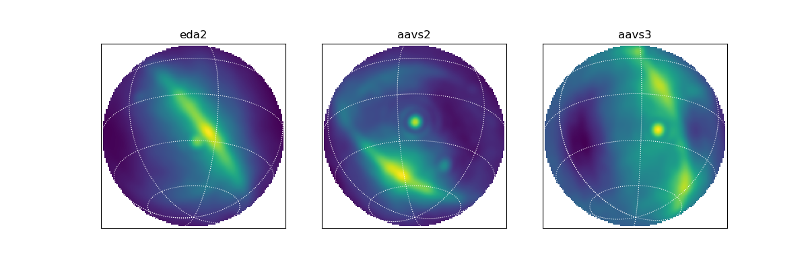

.. hyperseti documentation master file, created by
   sphinx-quickstart on Fri Mar 24 14:41:40 2023.
   You can adapt this file completely to your liking, but it should at least
   contain the root `toctree` directive.

aa_uv: Aperture Array UV Utilities
==================================

Utilities for handling UV data products for low-frequency aperture array telescopes.

.. toctree::
   :maxdepth: 2
   :caption: Overview

   conversion
   uvx

.. toctree::
   :maxdepth: 2
   :caption: AA UV code listing

   io
   utils

.. toctree::
   :maxdepth: 2
   :caption: QA + Imaging

   postx

Indices and tables
==================

* :ref:`genindex`
* :ref:`modindex`
* :ref:`search`