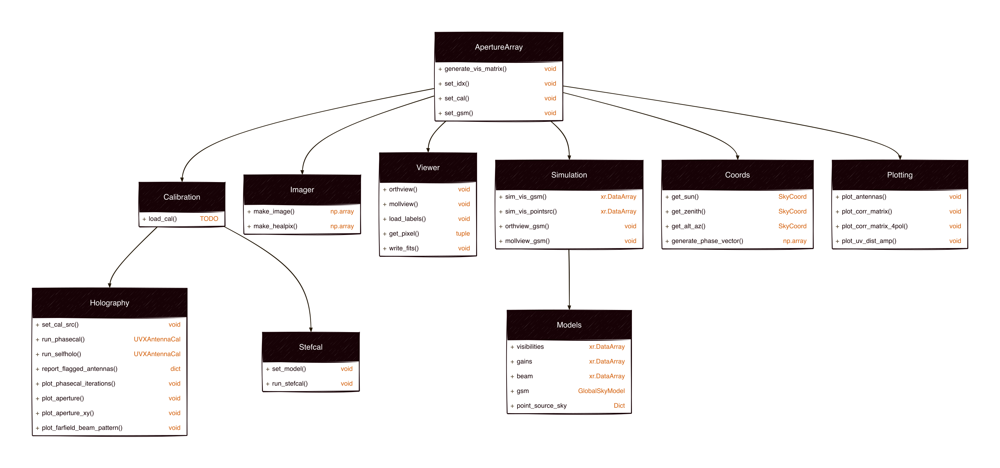

# `postx`: Post-correlation beamforming utilities



This module provides tools to visualize correlator data, and to
create images via post-correlation beamforming techniques.

The primary object is `ApertureArray`, which is created from a
UVX object:

```python
from ska_ost_low_uv.io import hdf5_to_uvx
from ska_ost_low_uv.postx import ApertureArray

uvx = hdf5_to_uvx('correlation_burst_100_20211113_14447_0.hdf5', telescope_name='aavs3')
aa = ApertureArray(uvx)
```

Functionality is broken down into sub-modules, which can be accessed using tab completion in Jupyter.
The modules are:

* `plotting`: Tools to visualize and plot the visibility matrix and antenna positions.
* `coords`: Tools for coordinate transformations and calculations.
* `calibration`: Tools to calculate antenna gains for calibration,
   via [JishnuCal](https://ui.adsabs.harvard.edu/abs/2024RaSc...5907847T/abstract) (self-holography) or
   [StefCal](https://ui.adsabs.harvard.edu/abs/2014A%26A...571A..97S/abstract) (alternating direction-implicit method).
* `simulation`: Tools to simulate the response of the array, used in calibration.
   Provides access to [global diffuse sky models](https://ui.adsabs.harvard.edu/abs/2016ascl.soft03013P/abstract).
* `imaging`: Creation of all-sky images using [post-correlation beamforming](https://ui.adsabs.harvard.edu/abs/2024PASA...41...37P/abstract),
  in 2D gridded orthographic ('snapshot imaging') or direct imaging on the healpix grid.
* `viewer`: Tools to view images and save them to FITS files.
