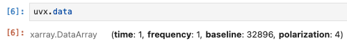

## UVX: A visibility data model with xarray and HDF5

UVX is a simple data model for radio interferometer visibilities in Python,
with a corresponding HDF5 schema for data storage. The `UVX` format is intended to be lightweight, but to contain all necessary information and metadata. Notably, it does not store UVW baseline coordinates (which can be computed as needed from antenna coordinates).

UVX is designed for situations where the visibilities can be treated as a multi-dimensional
array (i.e. a tensor), with axes corresponding to time, frequency, baseline ID,
and polarization:



Each axis has a corresponding dimension coordinate array, which maps array indexes to a corresponding time/frequency/baseline/polarization coordinate. This is the natural output structure for correlation codes.

In contrast, traditional UV formats (e.g. UVFITS, CASA MeasurementSet), store data as tables. In table-based formats, each row contains the data for one antenna pair, and corresponding time, antenna IDs, baseline UVW coordinates, weights, flags, integration length, etc. While this approach is flexible -- each row can be treated fully independently -- it essentially rips apart the correlator's natural array output. While necessary in some use cases (e.g. missing baselines, baseline-dependent averaging), the conversion is only applied so existing software can read the data.

There are several advantages to keeping visibility data in a multi-dimensional array. Many algorithms require that the correlation matrix is constructed, which is trivial from an array, but difficult (and inefficient) from a table. The corresponding data volume is also much smaller for arrays than for tables.

### The `UVX` Python dataclass

In Python, `UVX` uses the `DataArray` and `Dataset` classes from [xarray](https://docs.xarray.dev/en/stable/), and uses [astropy](https://www.astropy.org/) for coordinates (`EarthLocation`, `SkyCoord`), units (`Quantity`) and time (`Time`).

The `UVX` dataclass definition is short enough to include here:

```python
import xarray as xp
from astropy.coordinates import SkyCoord, EarthLocation
from astropy.time import Time

@dataclass
class UVX:
    name: str               # Antenna array name, e.g. AAVS3
    context: dict           # Contextual information (observation intent, notes, observer name)
    antennas: xp.Dataset    # An xarray dataset (generated with create_antenna_data_array)
    data: xp.DataArray      # An xarray DataArray (generated with create_visibility_array)
    timestamps: Time        # Astropy timestamps Time() array
    origin: EarthLocation   # Astropy EarthLocation for array origin
    phase_center: SkyCoord  # Astropy SkyCoord corresponding to phase center
    provenance: dict        # Provenance/history information and other metadata
```

There are two main datasets:
   1) `data`, which stores the visibility data, and
   2) `antennas`, which stores the antenna locations.

For these to be useful, one also needs to know the
   1) `origin`: where on the Earth the antennas are located, which is stored in as an astropy `EarthLocation()`, and
   2) `phase_center`: where the array is pointed, stored in an astropy `SkyCoord()`.

Metadata about why the observation was done is stored in  `context`, and other information about how the file came to be is stored in `provenance`. Note that there is also a `timestamps` attribute; time information is available in the `data` array, but the astropy `Time()` class provides incredibly useful functionality.

#### Visibility data

Visibility data are stored in a `DataArray` with the following attributes:

```
<xarray.DataArray (time: N_time, frequency: N_freq, baseline: N_bl, polarization: N_pol)>
    Coordinates:
    * time          (time) object MultiIndex
    * mjd           (time) time in MJD
    * lst           (time) time in LST
    * polarization  (polarization) <U2 'XX' 'XY' 'YX' 'YY'
    * baseline      (baseline) object MultiIndex
    * ant1          (baseline) int64 0 0 0 0 0 0 0 ... N_ant
    * ant2          (baseline) int64 0 1 2 3 4 5 6 ... N_ant
    * frequency     (frequency) float64 channel frequency values, in Hz
```

 The [SDP `Visibility`](https://developer.skao.int/projects/ska-sdp-datamodels/en/latest/xarray.html) datamodel shares similarities with `UVX` Visibility data, but notably stores UVW coordinates and weights, which `UVX` does not.

#### Antenna data

Antenna locations are stored as an xarray `Dataset`, relative to the `UVX.origin` (which is an astropy `EarthLocation`).

```
<xarray.Dataset>
    Dimensions:  (antenna: N_ant, spatial: 3)
    Coordinates:
    * antenna  (antenna) int64 0 1 2 3 4 5 6 7 ... N_ant
    * spatial  (spatial) <U1 'x' 'y' 'z'

    Data variables:
        enu      (antenna, spatial) float64 East-North-Up coordinates relative to eloc
        ecef     (antenna, spatial) float64 ECEF XYZ coordinates (XYZ - eloc.XYZ0)

    Attributes:
        identifier:               Antenna names / identifiers
        flags:                    Flags if antenna is bad
        array_origin_geocentric:  Array origin (ECEF)
        array_origin_geodetic:    Array origin (lat/lon/height)
```

### HDF5 specification

UVX can be stored in HDF5 using the `ska_ost_low_uv.io.write_uvx` method, and retrieved using `ska_ost_low_uv.io.read_uvx`. So that the data are self-documenting (that is, within the HDF5 abstract data model), descriptions for each dataset and group are written, based on the schema in `ska_ost_low_uv/datamodel/uvx.yaml`:

```yaml
uvx:
  CLASS: AA_UV
  VERSION: X.Y.Z
  hdf5_type: root

###############
# Context group
uvx/context:
  description: Contextual information about observation.

#################
# Antennas group
uvx/antennas:
  description: Antenna array spatial coordinate details.
  hdf5_type: group
uvx/antennas/attrs:
  description: Antenna array metadata, including array origin
  hdf5_type: group
uvx/antennas/attrs/array_origin_geocentric:
  description: Array center in WGS84 ECEF coordinates
  dims:
    - spatial
  hdf5_type: dataset
uvx/antennas/attrs/array_origin_geodetic:
  description: Geodetic array center in Longitude, Latitude, Height
  dims:
    - spatial
  hdf5_type: dataset
uvx/antennas/attrs/flags:
  description: Data quality issue flag, per antenna.
  dims:
    - antenna
  hdf5_type: dataset
uvx/antennas/attrs/identifier:
  description: Antenna name/identifier
  dims:
    - antenna
  hdf5_type: dataset
uvx/antennas/coords:
  description: Data coordinates for antenna data
  hdf5_type: group
uvx/antennas/coords/antenna:
  description: Antenna index (numerical, 0-based)
  dims:
    - antenna
  hdf5_type: dataset
uvx/antennas/coords/spatial:
  description: Spatial (X, Y, Z) coordinate
  dims:
    - spatial
  hdf5_type: dataset
uvx/antennas/ecef:
  description: Antenna WGS84 locations in Earth-centered, Earth-fixed (ECEF) coordinate system.  Note array center (origin) position (X0, Y0, Z0) has been subtracted.
  dims:
    - antenna
    - spatial
  units: m
  hdf5_type: dataset
uvx/antennas/enu:
  description: Antenna locations in local East-North-Up coordinates
  dims:
    - antenna
    - spatial
  units: m
  hdf5_type: dataset

####################
# Visibilities group
uvx/visibilities:
  description: Visibility data. (inter-antenna cross-correlations).
  hdf5_type: group
uvx/visibilities/attrs:
  description: Additional visibility metadata.
  hdf5_type: group
uvx/visibilities/coords:
  description: Data coordinates for visibility data
  hdf5_type: group
uvx/visibilities/coords/baseline:
  description: Antenna baseline coordinate
  hdf5_type: group
uvx/visibilities/coords/baseline/ant1:
  description: Baseline antenna 1 index
  hdf5_type: dataset
  dims:
    - antenna
uvx/visibilities/coords/baseline/ant2:
  description: Baseline antenna 2 index
  hdf5_type: dataset
  dims:
    - antenna
uvx/visibilities/coords/frequency:
  description: Frequency at channel center
  hdf5_type: dataset
  dims:
    - frequency
  units: Hz
uvx/visibilities/coords/polarization:
  description: Polarization products coordinate
  hdf5_type: dataset
  dims:
    - polarization
uvx/visibilities/coords/time:
  description: Time coordinate
  hdf5_type: group
uvx/visibilities/coords/time/lst:
  description: Local apparent sidereal time
  hdf5_type: dataset
  dims:
    - time
  units: hr
uvx/visibilities/coords/time/mjd:
  description: Modified Julian Date
  hdf5_type: dataset
  dims:
    - time
  format: mjd
uvx/visibilities/coords/time/unix:
  description: "Unix timestamp (seconds since 1970-01-01 00:00:00 UTC)"
  hdf5_type: dataset
  dims:
    - time
  format: unix
uvx/visibilities/data:
  description: Visibility dataset / correlation tensor
  dims:
    - time
    - frequency
    - baseline
    - polarization
  hdf5_type: dataset

###############
# Phase center
uvx/phase_center:
  description: Array phase center / pointing information.
  hdf5_type: group
uvx/phase_center/ra:
  description: Right Ascension (J2000)
  hdf5_type: dataset
uvx/phase_center/dec:
  description: Declination (J2000)
  hdf5_type: dataset

###############
# Provenance
uvx/provenance:
  description: History and data provenance information.
  hdf5_type: group
uvx/provenance/ska_ost_low_uv_config:
  description: Software versions used in file generation.
  hdf5_type: group
uvx/provenance/input_files:
  description: Input files used in file generation.
  hdf5_type: group
uvx/provenance/input_metadata:
  description: Metadata from input files used in file generation.
  hdf5_type: group
uvx/provenance/station_config:
  description: Station data capture firmware/software setup and configuration information.
  hdf5_type: group
```
